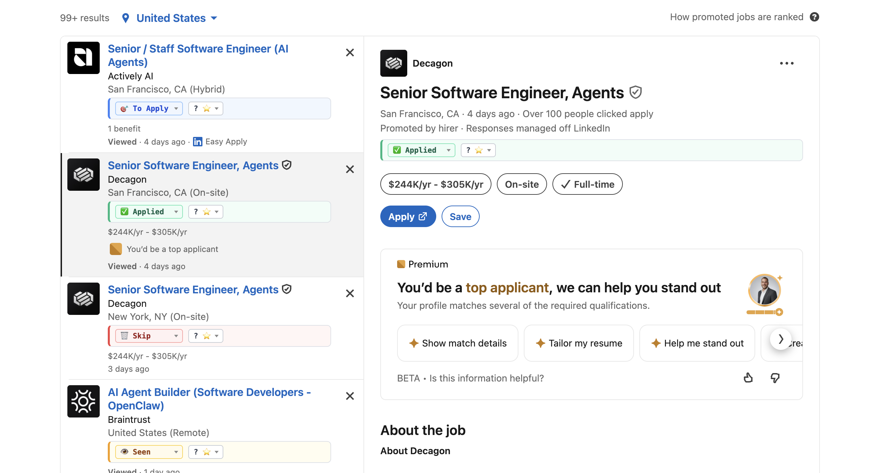
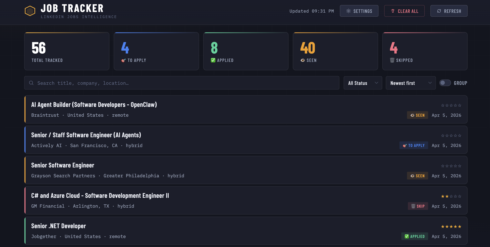

# LinkedIn Jobs Tracker

A Chrome Extension (Manifest V3) that adds status tracking and rating directly to LinkedIn job cards — so you can manage your job search without leaving the page.



## Features

- **Inline status panel** on every job card — set status and rating without opening a new tab
- **5 statuses**: None, 🎯 To Apply, 👁 Seen, ✅ Applied, 🗑 Skip — each with a distinct color
- **Star rating** — rate jobs 0–5 from within the card
- **Dashboard** — dedicated page with search, filtering, sorting, grouping, and stats
- **Optional background tinting** — color-code job cards and detail panels by status (off by default, toggle in Settings)
- **Live sync** — status changes reflect instantly across all open panels
- **Persistent storage** — all data saved locally via `chrome.storage.local`, no account needed

---

## Installation

1. Clone or download this repo
2. Open Chrome → `chrome://extensions`
3. Enable **Developer mode** (top-right toggle)
4. Click **Load unpacked** and select this folder
5. Go to [linkedin.com/jobs](https://www.linkedin.com/jobs/) — panels appear automatically

---

## How It Works

### On LinkedIn

Each job card gets a small inline panel with a **status dropdown** and **star rating**:

| Status | Icon | Meaning |
|---|---|---|
| None | — | Not yet reviewed |
| To Apply | 🎯 | Flagged to apply later |
| Seen | 👁 | Reviewed, no decision yet |
| Applied | ✅ | Application submitted |
| Skip | 🗑 | Not interested |

Changes save instantly.

> **Auto-Seen:** When you click a job and the right-side detail panel loads, if the job has no status (or `None`), it is automatically marked as **👁 Seen** and saved. Jobs that already have a status are never overwritten by this.

### Dashboard

Click the extension icon to open the dashboard:



- **Stats bar** — live counts per status
- **Search** — filter by title, company, location, or workplace
- **Filter by status** — show only jobs with a specific status
- **Sort** — newest, oldest, title, company, or rating
- **Group** — toggle grouping by status
- **Settings** (⚙ gear icon) — configure background color tinting:
  - *Color left panel cards* — background tint on job cards in the search list
  - *Color right panel* — background tint on the job detail view

---

## File Structure

```
linkedin-chrome-addon/
├── manifest.json         # Extension config (MV3)
├── options.js            # Shared status config — values, icons, colors, CSS keys
├── content.js            # Injected into LinkedIn jobs pages
├── styles.css            # Styles for injected panels
├── background.js         # Service worker — opens dashboard on extension click
├── dashboard.html        # Dashboard page
├── dashboard.js          # Dashboard logic
├── dashboard.css         # Dashboard styles
└── screenshots/
    ├── linkedin-search.png
    └── dashboard.png
```

---

## Storage Schema

All data is stored in `chrome.storage.local`. Job entries use a fingerprint key:

```json
{
  "ljt_idx__<title>||<company>||<location>||<workplace>": {
    "status": "Applied",
    "rating": 4,
    "seen_at": 1712345678901,
    "id": "4381854620",
    "title": "Lead Software Engineer",
    "company": "Acme Corp",
    "location": "New York, NY",
    "workplace": "remote"
  },
  "ljt_settings": {
    "colorLeft": false,
    "colorRight": false
  }
}
```

Settings are stored under `ljt_settings` and are excluded from the **Clear All** operation.

---

## Clearing Data

Use the **Clear All** button in the dashboard, or run this in the Chrome DevTools console on any LinkedIn page:

```js
window.postMessage({ type: 'LJT_CLEAR' }, '*')
```

---

## Reloading After Edits

After editing any file:
1. Go to `chrome://extensions`
2. Click the **reload** icon on the extension card
3. Refresh the LinkedIn tab
